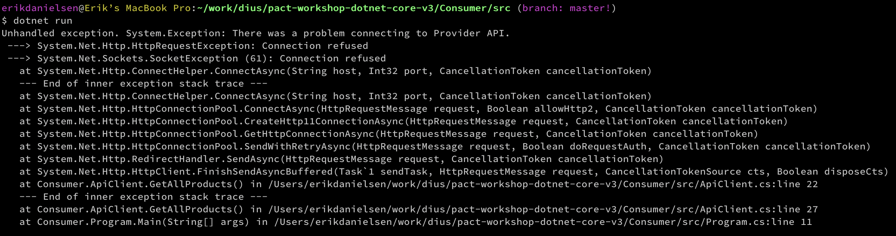

# Pact .NET Core Workshop

When writing a lot of small services, testing the interactions between these becomes a major headache.
That's the problem Pact is trying to solve.

Integration tests typically are slow and brittle, requiring each component to have its own environment to run the tests in.
With a micro-service architecture, this becomes even more of a problem. They also have to be 'all-knowing' and this makes them
difficult to keep from being fragile.

After J. B. Rainsberger's talk [Integrated Tests Are A Scam](https://www.youtube.com/watch?v=VDfX44fZoMc) people have been thinking
how to get the confidence we need to deploy our software to production without having a tiresome integration test suite that does
not give us all the coverage we think it does.

PactNet is a .NET implementation of Pact that allows you to define a pact between service consumers and providers. It provides a DSL for
service consumers to define the request they will make to a service producer and the response they expect back. This expectation is
used in the consumer's specs to provide a mock producer and is also played back in the producer specs to ensure the producer actually
does provide the response that the consumer expects.

This allows you to test both sides of an integration point using fast unit tests.

## Introduction

This workshop is aimed at demonstrating core features and benefits of contract testing with Pact.

Whilst contract testing can be applied retrospectively to systems, we will follow the [consumer driven contracts](https://martinfowler.com/articles/consumerDrivenContracts.html) approach in this workshop - where a new consumer and provider are created in parallel to evolve a service over time, especially where there is some uncertainty with what is to be built.

This workshop should take from 1 to 2 hours, depending on how deep you want to go into each topic.

**Workshop outline**:
- [Prerequisites](#prerequisites)
- [Workshop Steps](#workshop-steps)
  - [Preamble: **clone repository and explore**](#preamble---clone-repository-and-explore)
  - [Step 1: **create consumer**](#step-1---simple-consumer-calling-provider): Create our consumer before the Provider API even exists
  - [Step 2: **integration problems!**](#step-2---integration problems!): Connecting the client to the product service
  - [Step 3: **pact test**](#step-3---pact-to-the-rescue): Write a Pact test for our consumer
  - [Step 4: **pact verification**](#step-4---verify-the-provider): Verify the consumer pact with the Provider API
  - [Step 5: **fix consumer**](#step-5---back-to-the-client-we-go): Fix the consumer's bad assumptions about the Provider

## Learning objectives

If running this as a team workshop format, you may want to take a look through the [learning objectives](./LEARNING.md).

# Prerequisites

This workshop while written with .NET Core is not specifically about it so in-depth knowledge of .NET Core is not required if you can
write code in any other language you should be fine.

However before taking part in this workshop please make sure you have:

* [.NET Core SDK](https://www.microsoft.com/net/download/). Make sure you pick version 3.1 for this.
* An account at [Github.com](www.github.com)!
* A text editor/IDE that supports .NET Core. Check out [VSCode](https://code.visualstudio.com/)

## Add the Pacflow Nuget repository to Visual Studio/NuGet.Config

In order to use the 4.0.0-beta version of Pact.Net you need to add the Pacflow Nuget repository to Visual Studio and/or your Nuget.Config
file so that the libraries can be downloaded.

* For Visual Studio add `https://pactfoundation.jfrog.io/artifactory/api/nuget/default-nuget-local` as a Package Source. In order to see the
package you'll need to tick the `Include prereleases` checkbox since the libraries we'll use are beta versions
* For NuGet.Config (found at %appdata%\NuGet\NuGet.Config (Windows) or ~/.config/NuGet/NuGet.Config (Mac/Linux)) add
`<add key="ArtifactoryNuGetV3" value="https://pactfoundation.jfrog.io/artifactory/api/nuget/v3/default-nuget-local" protocolVersion="3" />`

# Workshop Steps

## Preamble: Clone repository and explore

Clone [pact-workshop-dotnet-core-v3](https://github.com/dius/pact-workshop-dotnet-core-v3) and familiarise yourself with
its contents. There are two components in scope for our workshop.

1. Product client. A command line client that queries the Product service for product information.
1. Product Service (Provider). Provides useful things about products, such as listing all products and getting the details of an individual product.

The two components can be found in their respective folders and each have a solution (`.sln`) file and project files for the app and test projects (`.csproj`)

### Consumer

A consumer project in the **Consumer/src** folder which is a simple .NET Core console application that connects to the
Provider project

### Provider

A provider in the **Provider/src** folder and is an ASP.NET Core Web API. Both projects also have a **tests/** folder which
is where the [Pact](https://docs.pact.io/) tests for both projects exist.

## Step 1: Simple consumer calling provider

We need to first create an HTTP client to make the calls to our provider service:


The Consumer has implemented the product service client which has the following:

- `GET /products` - Retrieve all products
- `GET /products/{id}` - Retrieve a single product by ID

The diagram below highlights the interaction for retrieving a product with ID 10:


You can see the client interface we created in `Consumer/src/ApiClient.cs`:

```csharp
using System;
using System.Net.Http;
using System.Threading.Tasks;

namespace Consumer
{
    public class ApiClient
    {
        private readonly Uri BaseUri;

        public ApiClient(Uri baseUri)
        {
            this.BaseUri = baseUri;
        }

        public async Task<HttpResponseMessage> GetAllProducts()
        {
            using (var client = new HttpClient { BaseAddress = BaseUri })
            {
                try
                {
                    var response = await client.GetAsync($"/api/products");
                    return response;
                }
                catch (Exception ex)
                {
                    throw new Exception("There was a problem connecting to Products API.", ex);
                }
            }
        }

        public async Task<HttpResponseMessage> GetProduct(int id)
        {
            using (var client = new HttpClient { BaseAddress = BaseUri })
            {
                try
                {
                    var response = await client.GetAsync($"/api/products/{id}");
                    return response;
                }
                catch (Exception ex)
                {
                    throw new Exception("There was a problem connecting to Products API.", ex);
                }
            }
        }
    }
}
```

After forking or cloning the repository, we may want to install the dependencies:

1. `cd Consumer\src`
2. `dotnet restore`

We can run the client with `dotnet run` - it should fail with the error below, because the Provider is not running.



# Step 2 - Integration problems!

our provider team has started building out their API in parallel. Let's run our website against our provider (you'll need two terminals to do this):


```console
# Terminal 1
erikdanielsen@Erik’s MacBook Pro:~/work/dius/pact-workshop-dotnet-core-v3/Provider/src (branch: master!)
$ dotnet run
Hosting environment: Development
Content root path: /Users/erikdanielsen/work/dius/pact-workshop-dotnet-core-v3/Provider/src
Now listening on: http://localhost:9001
Application started. Press Ctrl+C to shut down.
```

```console
# Terminal 2
erikdanielsen@Erik’s MacBook Pro:~/work/dius/pact-workshop-dotnet-core-v3/Consumer/src (branch: master!)
$ dotnet run
**Retrieving product list**
Response.Code=OK, Response.Body=[
  {
    "id": 1,
    "name": "GEM Visa",
    "type": "CREDIT_CARD",
    "version": "v2"
  },
  {
    "id": 2,
    "name": "28 Degrees",
    "type": "CREDIT_CARD",
    "version": "v1"
  },
  {
    "id": 3,
    "name": "Commonwealth Bank Platinum Visa",
    "type": "CREDIT_CARD",
    "version": "v1"
  }
]


**Retrieving product with id=1**
Response.Code=NotFound, Response.Body=

```

So we're able to retrieve a list of products but not a specific product even though one exists with id=1. We're getting a *404* response every time we attempt to access an individual product.

We need to have a conversation about what the endpoint should be!

## Step 3 - Pact to the rescue

Unit tests are written and executed in isolation of any other services. When we write tests for code that talk to other services, they are built on trust that the contracts are upheld. There is no way to validate that the consumer and provider can communicate correctly.

> An integration contract test is a test at the boundary of an external service verifying that it meets the contract expected by a consuming service — [Martin Fowler](https://martinfowler.com/bliki/IntegrationContractTest.html)

Adding contract tests via Pact would have highlighted the `/product/{id}` endpoint was incorrect.

Let us add Pact to the project and write a consumer pact test for the `GET /product/{id}` endpoint.

*Provider states* is an important concept of Pact that we need to introduce. These states help define the state that the provider should be in for specific interactions. For the moment, we will initially be testing the following states:

- `product with ID 10 exists`
- `products exist`

The consumer can define the state of an interaction using the `given` property.

Note how similar it looks to a unit test:

```csharp
using System.IO;
using PactNet;
using PactNet.Native;
using Xunit.Abstractions;
using Xunit;
using System.Net.Http;
using System.Net;
using System.Collections.Generic;
using Newtonsoft.Json;
using Newtonsoft.Json.Serialization;
using Consumer;

namespace tests
{
    public class ApiTest
    {
        private IPactBuilderV3 pact;
        private readonly ApiClient ApiClient;
        private readonly int port = 9000;
        private readonly List<object> products;

        public ApiTest(ITestOutputHelper output)
        {
            products = new List<object>()
            {
                new { id = 9, type = "CREDIT_CARD", name = "GEM Visa", version = "v2" },
                new { id = 10, type = "CREDIT_CARD", name = "28 Degrees", version = "v1" }
            };

            var Config = new PactConfig
            {
                PactDir = Path.Join("..", "..", "..", "..", "..", "pacts"),
                LogDir = "pact_logs",
                Outputters = new[] { new XUnitOutput(output) },
                DefaultJsonSettings = new JsonSerializerSettings
                {
                    ContractResolver = new CamelCasePropertyNamesContractResolver()
                }
            };

            pact = Pact.V3("ApiClient", "ProductService", Config).UsingNativeBackend(port);
            ApiClient = new ApiClient(new System.Uri($"http://localhost:{port}"));
        }

        [Fact]
        public async void GetAllProducts()
        {
            // Arange
            pact.UponReceiving("A valid request for all products")
                    .Given("There is data")
                    .WithRequest(HttpMethod.Get, "/api/products")
                .WillRespond()
                    .WithStatus(HttpStatusCode.OK)
                    .WithHeader("Content-Type", "application/json; charset=utf-8")
                    .WithJsonBody(products);

            await pact.VerifyAsync(async ctx => {
                var response = await ApiClient.GetAllProducts();
                Assert.Equal(HttpStatusCode.OK, response.StatusCode);
            });
        }

        [Fact]
        public async void GetProduct()
        {
            // Arange
            pact.UponReceiving("A valid request for a product")
                    .Given("There is data")
                    .WithRequest(HttpMethod.Get, "/api/product/10")
                .WillRespond()
                    .WithStatus(HttpStatusCode.OK)
                    .WithHeader("Content-Type", "application/json; charset=utf-8")
                    .WithJsonBody(products[1]);

            await pact.VerifyAsync(async ctx => {
                var response = await ApiClient.GetProduct(10);
                Assert.Equal(HttpStatusCode.OK, response.StatusCode);
            });
        }
    }

```


This test starts a mock server on a specificed port (9000 here) that acts as our provider service.

Running this test still passes, but it creates a pact file which we can use to validate our assumptions on the provider side, and have conversation around.

```console
$ dotnet test
  Determining projects to restore...
  All projects are up-to-date for restore.
  consumer -> /Users/erikdanielsen/work/dius/pact-workshop-dotnet-core-v3/Consumer/src/bin/Debug/netcoreapp3.1/consumer.dll
  tests -> /Users/erikdanielsen/work/dius/pact-workshop-dotnet-core-v3/Consumer/tests/bin/Debug/netcoreapp3.1/tests.dll
Test run for /Users/erikdanielsen/work/dius/pact-workshop-dotnet-core-v3/Consumer/tests/bin/Debug/netcoreapp3.1/tests.dll (.NETCoreApp,Version=v3.1)
Microsoft (R) Test Execution Command Line Tool Version 16.11.0
Copyright (c) Microsoft Corporation.  All rights reserved.

Starting test execution, please wait...
A total of 1 test files matched the specified pattern.

Passed!  - Failed:     0, Passed:     2, Skipped:     0, Total:     2, Duration: 12 ms - /Users/erikdanielsen/work/dius/pact-workshop-dotnet-core-v3/Consumer/tests/bin/Debug/netcoreapp3.1/tests.dll (netcoreapp3.1)
```

A pact file should have been generated in *pacts/ApiClient-ProductService.json*

*NOTE*: even if the API client had been graciously provided for us by our Provider Team, it doesn't mean that we shouldn't write contract tests - because the version of the client we have may not always be in sync with the deployed API - and also because we will write tests on the output appropriate to our specific needs.

## Step 4 - Verify the provider

Now let's make a start on writing Pact tests to validate the consumer contract:

In `provider/test/`:

```csharp
using System;
using System.Collections.Generic;
using System.IO;
using Microsoft.AspNetCore;
using Microsoft.AspNetCore.Hosting;
using PactNet;
using PactNet.Infrastructure.Outputters;
using PactNet.Native;
using tests.XUnitHelpers;
using Xunit;
using Xunit.Abstractions;

namespace tests
{
    public class ProductTest
    {
        private string _pactServiceUri = "http://127.0.0.1:9001";
        private ITestOutputHelper _outputHelper { get; }

        public ProductTest(ITestOutputHelper output)
        {
            if (context.Request.Path.StartsWithSegments("/provider-states/"))
            {
                await this.HandleProviderStatesRequest(context);
                await context.Response.WriteAsync(String.Empty);
            }
            else
            {
                await this._next(context);
            }
        }

        [Fact]
        public void EnsureProviderApiHonoursPactWithConsumer()
        {
            // Arrange
            var config = new PactVerifierConfig
            {
                // NOTE: We default to using a ConsoleOutput, however xUnit 2 does not capture the console output,
                // so a custom outputter is required.
                Outputters = new List<IOutput>
                {
                    new XUnitOutput(_outputHelper)
                }
            };

            using (var _webHost = WebHost.CreateDefaultBuilder().UseStartup<TestStartup>().UseUrls(_pactServiceUri).Build())
            {
                _webHost.Start();

                //Act / Assert
                IPactVerifier pactVerifier = new PactVerifier(config);
                var pactFile = new FileInfo(Path.Join("..", "..", "..", "..", "..", "pacts", "ApiClient-ProductService.json"));
                pactVerifier.FromPactFile(pactFile)
                    .WithProviderStateUrl(new Uri($"{_pactServiceUri}/provider-states"))
                    .ServiceProvider("ProductService", new Uri(_pactServiceUri))
                    .HonoursPactWith("ApiClient")
                    .Verify();
            }
        }
    }
}
```

We now need to validate the pact generated by the consumer is valid, by executing it against the running service provider, which should fail:

```console
$ dotnet test
  Determining projects to restore...
  Restored /Users/erikdanielsen/work/dius/pact-workshop-dotnet-core-v3/Provider/src/provider.csproj (in 71 ms).
  Restored /Users/erikdanielsen/work/dius/pact-workshop-dotnet-core-v3/Provider/tests/tests.csproj (in 265 ms).
  Restored /Users/erikdanielsen/work/dius/pact-workshop-dotnet-core-v3/Provider/src/provider.csproj (in 575 ms).
  provider -> /Users/erikdanielsen/work/dius/pact-workshop-dotnet-core-v3/Provider/src/bin/Debug/netcoreapp3.1/provider.dll
  tests -> /Users/erikdanielsen/work/dius/pact-workshop-dotnet-core-v3/Provider/tests/bin/Debug/net5.0/tests.dll
Test run for /Users/erikdanielsen/work/dius/pact-workshop-dotnet-core-v3/Provider/tests/bin/Debug/net5.0/tests.dll (.NETCoreApp,Version=v5.0)
Microsoft (R) Test Execution Command Line Tool Version 16.11.0
Copyright (c) Microsoft Corporation.  All rights reserved.

Starting test execution, please wait...
A total of 1 test files matched the specified pattern.

Verifying a pact between ApiClient and ProductService
  Given There is data
  Given There is data
  A valid request for a product
    returns a response which
      has status code 200 (FAILED)
      includes headers
        "Content-Type" with value "application/json; charset=utf-8" (FAILED)
      has a matching body (FAILED)
  A valid request for all products
    returns a response which
      has status code 200 (OK)
      includes headers
        "Content-Type" with value "application/json; charset=utf-8" (OK)
      has a matching body (OK)


Failures:

1) Verifying a pact between ApiClient and ProductService Given There is data - A valid request for a product returns a response which
    1.1) has a matching body
           / -> Expected body Present(65 bytes) but was empty
    1.2) has status code 200
           expected 200 but was 404
    1.3) includes header 'Content-Type' with value '"application/json; charset=utf-8"'
           Expected header 'Content-Type' to have value '"application/json; charset=utf-8"' but was ''

There were 1 pact failures

[xUnit.net 00:00:01.01]     tests.ProductTest.EnsureProviderApiHonoursPactWithConsumer [FAIL]
  Failed tests.ProductTest.EnsureProviderApiHonoursPactWithConsumer [401 ms]
  Error Message:
   PactNet.PactFailureException : The verification process failed, see output for errors
  Stack Trace:
     at PactNet.Native.NativePactVerifier.Verify(String args) in /Users/erikdanielsen/work/dius/pact-net/src/PactNet.Native/NativePactVerifier.cs:line 34
   at PactNet.Native.PactVerifier.Verify() in /Users/erikdanielsen/work/dius/pact-net/src/PactNet.Native/PactVerifier.cs:line 240
   at tests.ProductTest.EnsureProviderApiHonoursPactWithConsumer() in /Users/erikdanielsen/work/dius/pact-workshop-dotnet-core-v3/Provider/tests/ProductTest.cs:line 46
  Standard Output Messages:
 Invoking the pact verifier with args:
 --file
 /Users/erikdanielsen/work/dius/pact-workshop-dotnet-core-v3/pacts/ApiClient-ProductService.json
 --state-change-url
 http://127.0.0.1:9001/provider-states
 --provider-name
 ProductService
 --hostname
 127.0.0.1
 --port
 9001
 --filter-consumer
 ApiClient
 --loglevel
 trace


Failed!  - Failed:     1, Passed:     0, Skipped:     0, Total:     1, Duration: < 1 ms - /Users/erikdanielsen/work/dius/pact-workshop-dotnet-core-v3/Provider/tests/bin/Debug/net5.0/tests.dll (net5.0)
```


The test has failed, as the expected path `/product/{id}` is returning 404. We incorrectly believed our provider was following a RESTful design, but the authors were too lazy to implement a better routing solution 🤷.

The correct endpoint which the consumer should call is `/products/{id}`.

## Step 5 - Back to the client we go

We now need to update the consumer client and tests to hit the correct product path.

First, we need to update the GET route for the client:

In `Consumer/src/ApiClient.cs`:

```csharp
public async Task<HttpResponseMessage> GetProduct(int id)
{
    using (var client = new HttpClient { BaseAddress = BaseUri })
    {
        try
        {
            var response = await client.GetAsync($"/api/products/{id}");
            return response;
        }
        catch (Exception ex)
        {
            throw new Exception("There was a problem connecting to Provider API.", ex);
        }
    }
}
```

Then we need to update the Pact test `ID 10 exists` to use the correct endpoint in `path`.

In `Consumer/tests/ApiTest.cs`:

```csharp
[Fact]
public async void GetProduct()
{
    // Arange
    pact.UponReceiving("A valid request for a product")
            .Given("There is data")
            .WithRequest(HttpMethod.Get, "/api/products/10")
        .WillRespond()
            .WithStatus(HttpStatusCode.OK)
            .WithHeader("Content-Type", "application/json; charset=utf-8")
            .WithJsonBody(products[1]);

    await pact.VerifyAsync(async ctx => {
        var response = await ApiClient.GetProduct(10);
        Assert.Equal(HttpStatusCode.OK, response.StatusCode);
    });
}
```


Let's run and generate an updated pact file on the client:

```console
$ dotnet test
  Determining projects to restore...
  All projects are up-to-date for restore.
  consumer -> /Users/erikdanielsen/work/dius/pact-workshop-dotnet-core-v3/Consumer/src/bin/Debug/netcoreapp3.1/consumer.dll
  tests -> /Users/erikdanielsen/work/dius/pact-workshop-dotnet-core-v3/Consumer/tests/bin/Debug/netcoreapp3.1/tests.dll
Test run for /Users/erikdanielsen/work/dius/pact-workshop-dotnet-core-v3/Consumer/tests/bin/Debug/netcoreapp3.1/tests.dll (.NETCoreApp,Version=v3.1)
Microsoft (R) Test Execution Command Line Tool Version 16.11.0
Copyright (c) Microsoft Corporation.  All rights reserved.

Starting test execution, please wait...
A total of 1 test files matched the specified pattern.

Passed!  - Failed:     0, Passed:     2, Skipped:     0, Total:     2, Duration: 12 ms - /Users/erikdanielsen/work/dius/pact-workshop-dotnet-core-v3/Consumer/tests/bin/Debug/netcoreapp3.1/tests.dll (netcoreapp3.1)
```

Now we run the provider tests again with the updated contract

Run thse command under `Consumer/tests`:

```console
[1] $ dotnet test                                                                                                                                                                   ✘
  Determining projects to restore...
  Restored /Users/erikdanielsen/work/dius/pact-workshop-dotnet-core-v3/Provider/src/provider.csproj (in 53 ms).
  Restored /Users/erikdanielsen/work/dius/pact-workshop-dotnet-core-v3/Provider/tests/tests.csproj (in 225 ms).
  Restored /Users/erikdanielsen/work/dius/pact-workshop-dotnet-core-v3/Provider/src/provider.csproj (in 524 ms).
  provider -> /Users/erikdanielsen/work/dius/pact-workshop-dotnet-core-v3/Provider/src/bin/Debug/netcoreapp3.1/provider.dll
  tests -> /Users/erikdanielsen/work/dius/pact-workshop-dotnet-core-v3/Provider/tests/bin/Debug/net5.0/tests.dll
Test run for /Users/erikdanielsen/work/dius/pact-workshop-dotnet-core-v3/Provider/tests/bin/Debug/net5.0/tests.dll (.NETCoreApp,Version=v5.0)
Microsoft (R) Test Execution Command Line Tool Version 16.11.0
Copyright (c) Microsoft Corporation.  All rights reserved.

Starting test execution, please wait...
A total of 1 test files matched the specified pattern.

Verifying a pact between ApiClient and ProductService
  Given There is data
  Given There is data
  A valid request for a product
    returns a response which
      has status code 200 (OK)
      includes headers
        "Content-Type" with value "application/json; charset=utf-8" (OK)
      has a matching body (OK)
  A valid request for all products
    returns a response which
      has status code 200 (OK)
      includes headers
        "Content-Type" with value "application/json; charset=utf-8" (OK)
      has a matching body (OK)


Passed!  - Failed:     0, Passed:     1, Skipped:     0, Total:     1, Duration: < 1 ms - /Users/erikdanielsen/work/dius/pact-workshop-dotnet-core-v3/Provider/tests/bin/Debug/net5.0/tests.dll (net5.0)
```

Yay - green ✅!

